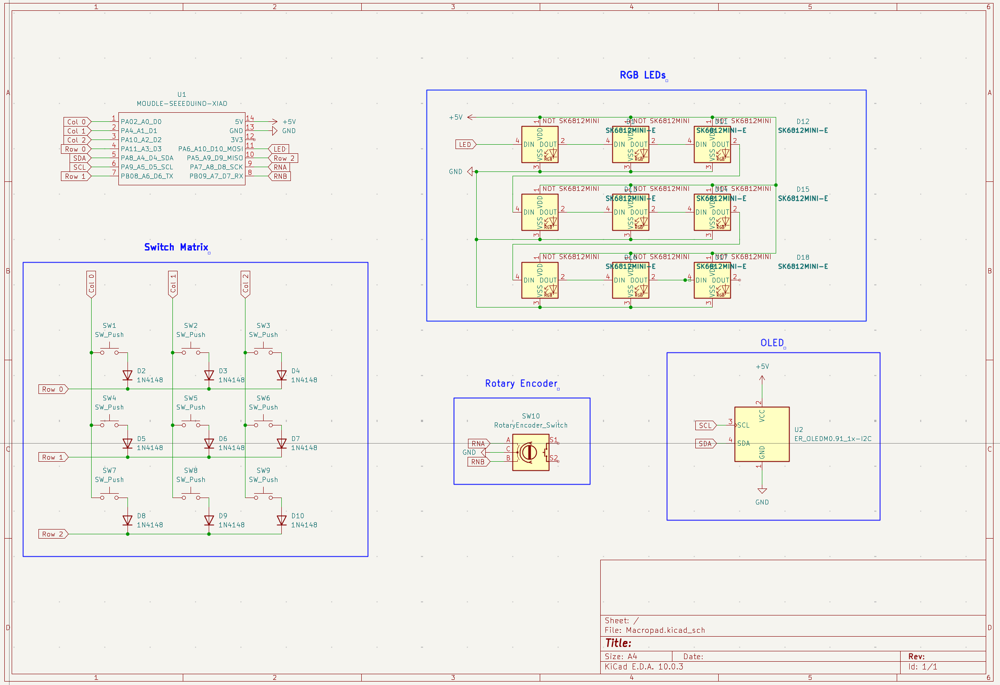
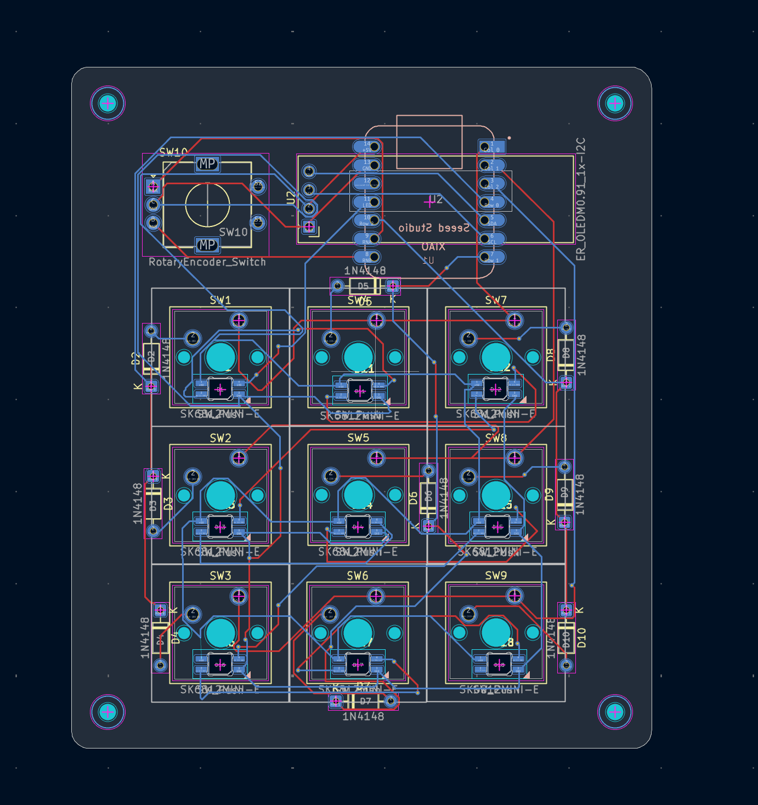
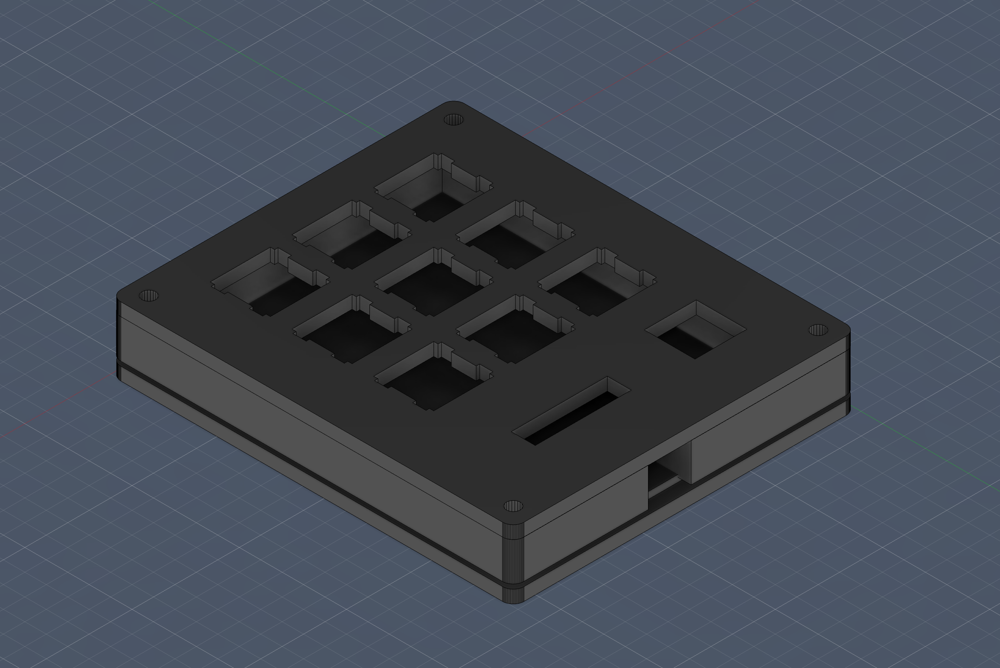

# katjapad

A 9-key macropad with a rotary encoder, OLED display, and per-key RGB lighting.
Built for productivity and media control.

## Features
- 9 MX-style switches in a 3x3 grid
- 1 rotary encoder for volume control
- 0.91" OLED display
- Per-key SK6812 MINI-E RGB LEDs
- QMK firmware with custom macros

## Screenshots

### Schematic

### PCB

### Case

## Bill of Materials (BOM)
| Part | Quantity |
|------|----------|
| Seeed XIAO RP2040 | 1 |
| MX-style switches | 9 |
| EC11 Rotary Encoder | 1 |
| 0.91" OLED Display | 1 |
| SK6812 MINI-E LEDs | 9 |
| 1N4148 Diodes | 9 |
| DSA Keycaps | 9 |
| M3x16mm Screws | 6 |
| M3 Heatset Inserts | 6 |

## Firmware
Built with QMK. Key features:
- Top row: Pomodoro timer, to-do list, study playlist (URL macros)
- Middle row: Copy, Paste, New Tab
- Bottom row: Previous, Play/Pause, Next
- Encoder: Volume up/down
